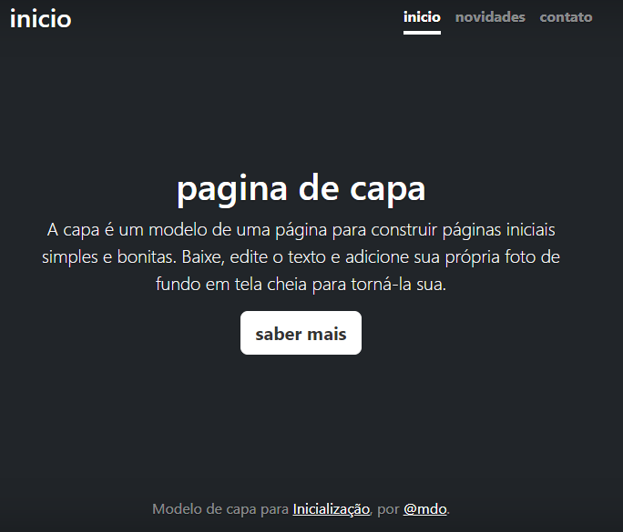

# inicio

* [projeto escrita do README](#projeto-escrita-do-readme)
* [descrição](#descri%C3%A7%C3%A3o)
* [introdução](#introdu%C3%A7%C3%A3o)
* [funcionalidade](#funcionalidade)
* [fontes utilizadas](#fontes-utilizadas)
* [autores ](#autores)

# Projeto escrita do README

## Descrição
nesse trabalho , pesquisamos projetos prontos e traduzimos para o github que temos usado ultimamente.E os exemplos foi feito de base para um projeto "nosso".
## Funcionalidades
serve para exibir as habilidades e o estilo de trabalho que desenvolvemos.
### Tecnologias utilizadas
HTML e CSS
## Fontes utilizadas
google tradutor
